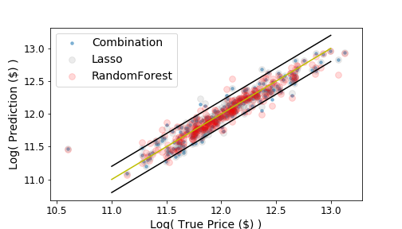

# House Prices: Advanced Regression Techniques

The notebook `lasso_randomforest_solution.ipynb` produces my solution for the [House Prices Kaggle competition](https://www.kaggle.com/c/house-prices-advanced-regression-techniques), which currently acheives a mean-squared error of 12% on the true testing house prices (75th percentile on leaderboard).

## Data

The training and testing data each consist of roughly 1500 recent house sales in Ames, Iowa. There are 79 feature columns including details of the condition, quality, and size of various areas of the house/lot, the number of bathrooms and fireplaces, and the material and style of the house exterior. The target for prediction is the sale price of the house.

## Pre-processing

## Analysis

### Lasso Regression

### Random Forest Regression

### Lasso + Random Forest

I found that the Lasso regression outperformed RandomForest; however, around the center of the price distribution, RandomForest was competetive or more accurate. For houses predicted in the central 60% of the training distribution, the predicted price is the average of Lasso and RandomForest predictions. Otherwise, only the Lasso prediction is used.

